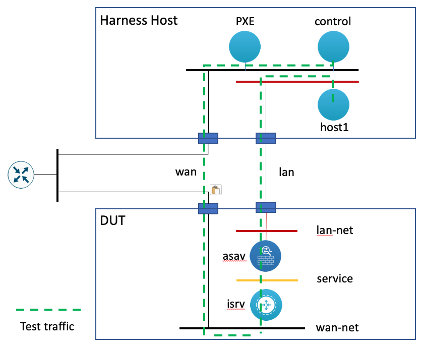
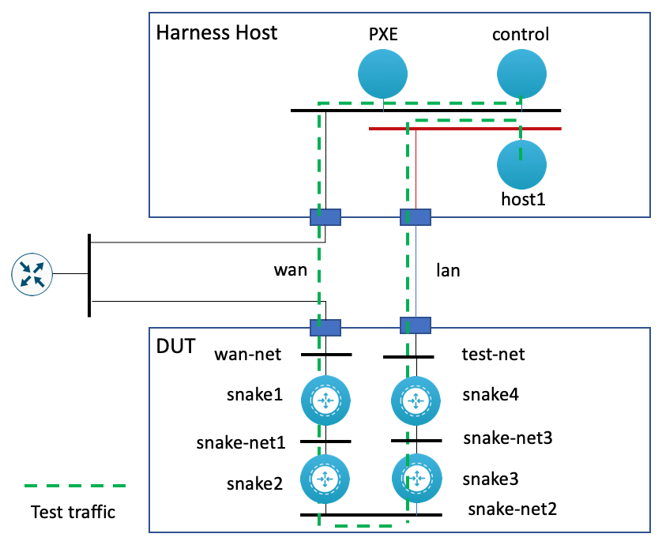

NFVISV Validation Harness

The NFVIS Test Harness is an NFVIS host (e.g. Cisco ENCS 5400, UCS, etc) and a set of tools used to test NFVIS on 3rd party hardware.  It can:

* Create a PXE environment to install NFVIS on the test
* Create packages and install them onto the NFVIS host
* Deploy test architectures on the the NFVIS host being tested
* Test those architectures with packet flows
* Clean up the architectures

### Dependancies:
* [ansible-nfvis](https://github.com/CiscoDevNet/ansible-nfvis)

### Cloning

Since `ansible-nfvis` is included as a submodule, a recurse close is needed:

```yaml
git@wwwin-github.cisco.com:ciscops/nfvis-harness.git --recursive
```

### Overview



The NFVIS Harness host is used as an environment in which to deploy the PXE server and other hosts for testing (e.g. source/sync hosts, viptela control plane, etc.)

### Test Scenarios

The NFVIS Validation Harness is written so that it can deploy different test scenarios.  For example, the scenario above
depicts a service chain deployment of an ISRv and an ASAv.  It can also deploy a simple ISRv router or a more complex SD-WAN
scenario.

The scenarios are created through Ansible inventory files that include the associated NFVIS hosts, the network configuration,
and the VNFs.  The VNFs are seeded with a template-driven boot-up configuration so that they come up with the required
configuration for the architecture.  They can also be automated post deployment for more complex deployment scenarios (e.g. setting up the SD-WAN).

### Load Test

The Load Test consists of a series of daisy chaned ISRvs (i.e. snake).  The number of ISRvs depends on the cores
available on the DUT (i.e. 1 ISRv per core)



#### Build the Snake:
`ansible-playbook build_snake.yml`

* Finds available cores
* Creates VNFs, bridges, & networks

##### Extra Vars:
* `max_vnf`: The maximum number of VNF to spin up on the DUT

`ansible-playbook build_snake.yml -e max_vnf=5`

#### Prepare the Snake:
`ansible-playbook prep_snake.yml`

* Get list of snake VNFs from DUT
* Waits for the VNF to boot
* Sets Smart Licensing parameters
* Registers VNF to Smart Licensing
* Waits for successful registration

#### Test the Snake:
`ansible-playbook test_snake.yml -e time=600`

* Runs iperf test from test host to control host

##### Extra Vars:
* `time`: The duration of the iperf test

#### Clean the Snake:
`ansible-playbook clean_snake.yml`

* Get list of snake VNFs from DUT
* Deregisters VNF from Smart Licensing
* Deletes VNFs, bridges, & networks
* Removes DUT's ssh key from known hosts