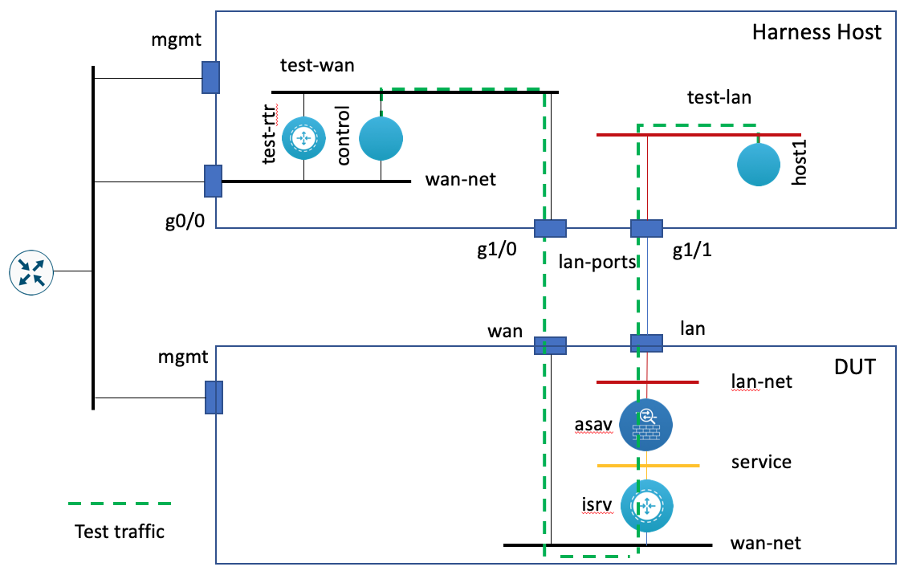
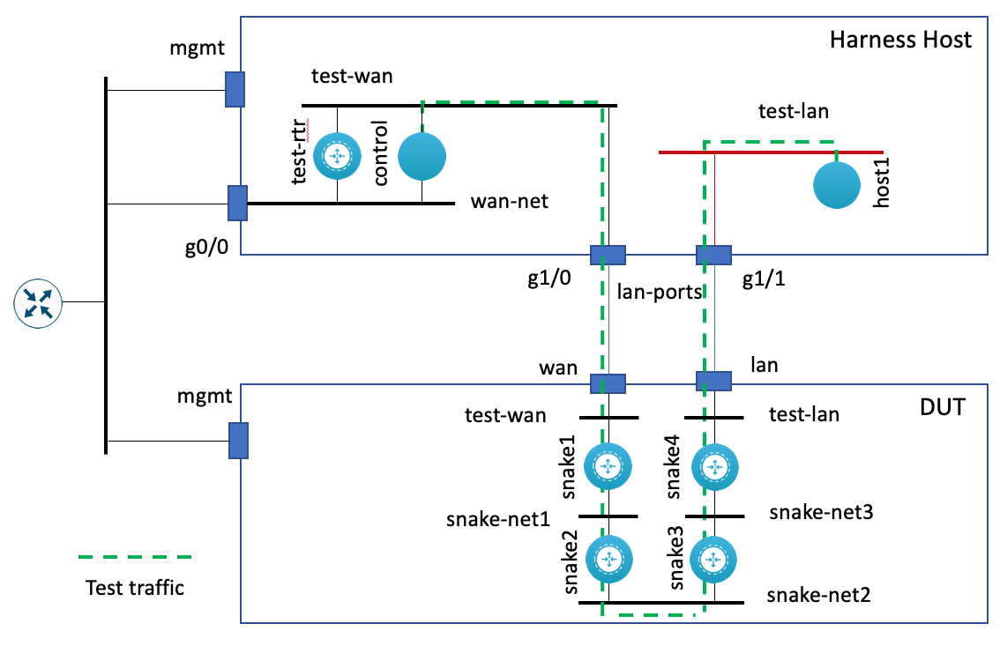

# NFVIS Test Harness

The NFVIS Test Harness is an NFVIS host (e.g. Cisco ENCS 5400, UCS, etc) and a set of tools used to test NFVIS on 3rd party hardware.  It can:

* Create a PXE environment to install NFVIS on the test
* Create packages and install them onto the NFVIS host
* Deploy test architectures on the the NFVIS host being tested
* Test those architectures with packet flows
* Clean up the architectures

## Overview

The NFVIS Harness host is used as an environment in which to deploy a PXE server, control node, test nodes, and other
hosts for testing (e.g. source/sync hosts, viptela control plane, etc.)

## Provisioning the Harness

### Setting IP Address of the Harness Hosts

In order to interact with the harness, IP information must be set in harness/harness.yml for the following devices:
* `harness`: Set the values for `ansible_host` and `interfaces.mgmt.ip`. Generally, these values will be the same (with prefix added to the latter) if you want to manage the device via the mgmt interface.
* `dut`: Set the values for `ansible_host` and `interfaces.mgmt.ip`. Generally, these values will be the same (with prefix added to the latter) if you want to manage the device via the mgmt interface.
* `test-rtr`: Set the values for `ansible_host`, `ansible_port` and `interfaces.GigabitEthernet2.ip`.  If you want to manage through the
Harness' mgmt interface, set `ansible_host` to the Harness' mgmt IP address and `ansible_port` the forwarding port.  `interfaces.GigabitEthernet2.ip` must be an IP address that is reacable by a licensing server if licensing is required.

### Building the Harness VNFs
* Deploy VNFs on harness

```
ansible-playbook build.yml -i harness/harness.yml
```

### Prepare the Harness VNFs
* Wait for VMs to boot
* Install required packages

```
ansible-playbook prep_harness.yml -i harness/harness.yml
```

### Cleaning the Harness VNFs
* Clean VNFs on harness

```
ansible-playbook build.yml -i harness/harness.yml
```

## Architecture Testing

The NFVIS Validation Harness is written so that it can deploy different test scenarios.  For example, the scenario above
depicts a service chain deployment of an ISRv and an ASAv.  It can also deploy a simple ISRv router or a more complex SD-WAN
scenario.



The scenarios are created through Ansible inventory files that include the associated NFVIS hosts, the network configuration,
and the VNFs.  The VNFs are seeded with a template-driven boot-up configuration so that they come up with the required
configuration for the architecture.  They can also be automated post deployment for more complex deployment scenarios (e.g. setting up the SD-WAN).

### Running an Architecture Scenario

Build architecture
```
ansible-playbook build.yml -i harness/isr_asa1.yml
```

Clean architecture
```
ansible-playbook clean.yml -i harness/isr_asa1.yml
```

## Load Testing

The Load Test consists of a series of daisy chaned ISRvs (i.e. snake).  The number of ISRvs
depends on the cores available on the DUT (i.e. 1 ISRv per core, but configurable).  The tooling below performs the following:

* Creates the bridges and networks to stitch the VNFs together on the DUT
* Instantiates the VNFs with 0-day configurations for the interface, routes, and OSPF peering.
* Waits for the VNF to become active
* Registers the VNF to the specified smart account and waits for it to be authorized
* Runs a bandwith test from the test node on the harness through the snake to the control node on the harness
* De-registers the VNF from the smart account
* Cleans up the VNFs, bridges, and networks from the DUT
* Cleans up the DUT's ssh host keys



### Build the Snake
* Finds available cores
* Creates VNFs, bridges, & networks

`ansible-playbook build_snake.yml`

##### Extra Vars
* `max_vnf`: The maximum number of VNF to spin up on the DUT

`ansible-playbook build_snake.yml -e max_vnf=5`

#### Prepare the Snake
* Get list of snake VNFs from DUT
* Waits for the VNF to boot
* Sets Smart Licensing parameters
* Registers VNF to Smart Licensing
* Waits for successful registration

`ansible-playbook prep_snake.yml`


#### Test the Snake
* Runs iperf test from test host to control host

`ansible-playbook iperf.yml -e time=600`

##### Extra Vars
* `time`: The duration of the iperf test

#### Clean the Snake
`ansible-playbook clean_snake.yml`

* Get list of snake VNFs from DUT
* Deregisters VNF from Smart Licensing
* Deletes VNFs, bridges, & networks
* Removes DUT's ssh key from known hosts